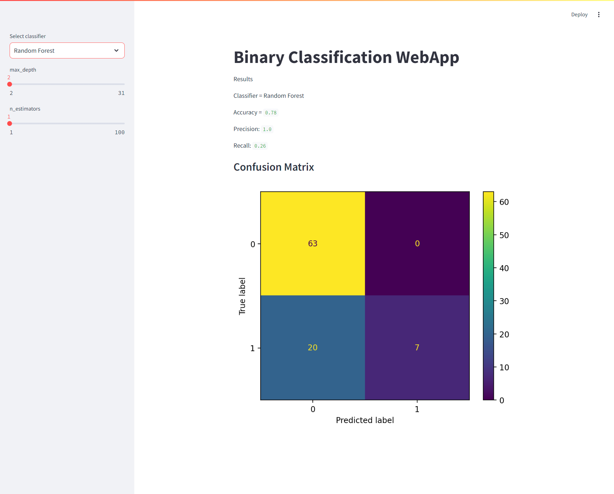
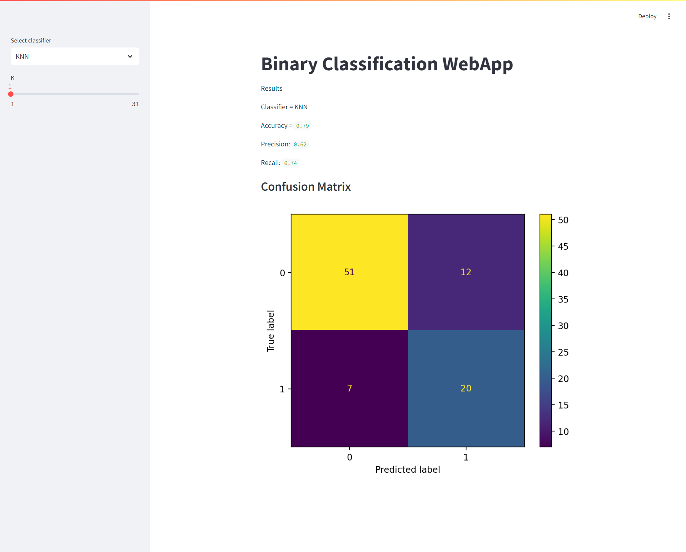
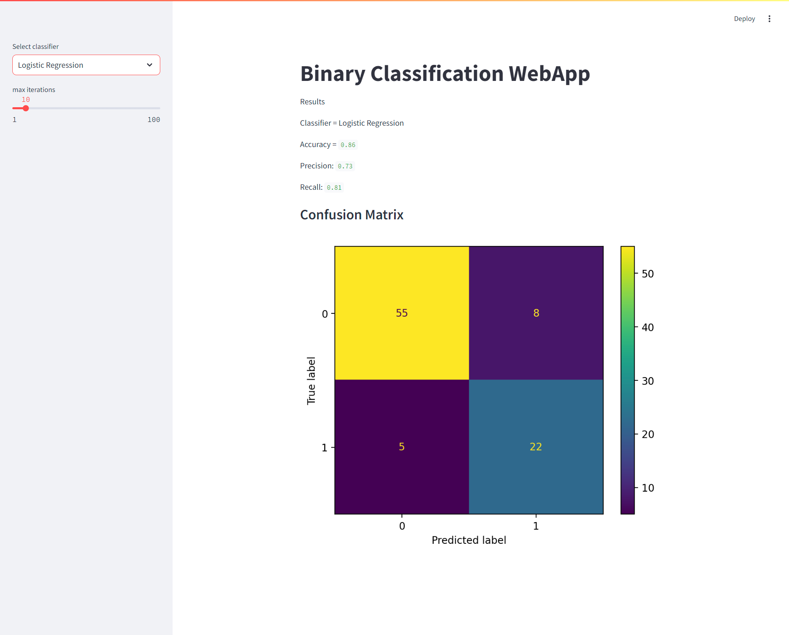

# Titanic Machine Learning - Classification Web App

## Overview

This repository contains two main components:
1. **Streamlit Web Application**: An interactive web app that allows users to predict the survival of passengers aboard the Titanic using various machine learning models.
2. **Jupyter Notebook**: A detailed notebook that walks through data exploration, visualization, preprocessing, and model evaluation steps.

Both the web app and the Jupyter notebook provide insights and tools to explore Titanic data and answer the key question: **"What kinds of people were more likely to survive?"**


## Context

The sinking of the Titanic is one of the most infamous shipwrecks in history. On April 15, 1912, during its maiden voyage, the widely considered "unsinkable" RMS Titanic sank after colliding with an iceberg. Tragically, there were not enough lifeboats for everyone on board, resulting in the deaths of 1,502 out of 2,224 passengers and crew. 

While survival was partly due to luck, some groups of people were more likely to survive than others. This project challenges you to build a predictive model that answers the question: **"What kinds of people were more likely to survive?"** using passenger data (such as age, gender, socio-economic class, etc.).

## Data Description

The data has been divided into two sets:

- **Training Set (train.csv)**: This dataset contains labeled data with information about passengers, including whether they survived or not. This data is used to train machine learning models.
- **Test Set (test.csv)**: This dataset contains information about passengers without survival labels. Your task is to predict the survival outcome for these passengers using your trained model.

The dataset contains the following features:

- **PassengerId:** Unique identifier for each passenger.
- **Survived:** Survival status (0 = No, 1 = Yes).
- **Pclass:** Passenger class (1 = 1st, 2 = 2nd, 3 = 3rd).
- **Name:** Name of the passenger.
- **Sex:** Gender of the passenger.
- **Age:** Age of the passenger.
- **SibSp:** Number of siblings/spouses aboard.
- **Parch:** Number of parents/children aboard.
- **Ticket:** Ticket number.
- **Fare:** Ticket fare.
- **Cabin:** Cabin number.
- **Embarked:** Port of embarkation (C = Cherbourg, Q = Queenstown, S = Southampton).


## What Has Been Done

1. **Data Preprocessing**:
    - Missing values were filled and categorical features were encoded using one-hot encoding.
    - Dropped duplicates and checked for missing values.
    - Filled missing values in 'Age', 'Cabin', and 'Embarked' using mode.
    - Converted categorical variables using OneHotEncoder and OrdinalEncoder.

2. **Exploratory Data Analysis (EDA)**: A comprehensive analysis of the dataset was conducted to understand the features, their distributions, and relationships with the target variable (Survived).
    
3. **Model Implementation**:
   - **K-Nearest Neighbors (K-NN) Classifier**: Implemented with GridSearchCV for hyperparameter optimization.
   - **Logistic Regression Classifier**: Implemented with GridSearchCV to find the best model parameters.
   - **Random Forest Classifier**: Implemented with GridSearchCV for optimized tree-based predictions.
   
4. **Web Application**: A **Streamlit** web app was developed to allow users to interact with the models and perform the following:
    - **Interactive Model Selection:** Choose between K-NN, Logistic Regression, and Random Forest classifiers.
    - **Hyperparameter Adjustment:** Modify hyperparameters like:
      - Number of neighbors (K for K-NN)
      - Regularization strength (C for Logistic Regression)
      - Number of trees (n_estimators for Random Forest)
    - **Model Training & Evaluation:** The app allows users to train the selected model and evaluates its performance using metrics like accuracy, precision, and recall.
    - **Confusion Matrix Visualization:** Visual representation of model predictions compared to actual outcomes.
       
5. **Results & Visualization**: 
   - After training, the app displays essential performance metrics like **accuracy, precision, recall**, and a **confusion matrix**.
   - Confusion matrices are shown visually, helping users understand the classification performance of each model.

<div style="display: flex; justify-content: space-between;">
    
    
    
</div>

## Usage Instructions

### 1. **Running the Streamlit Web App**:

1. **Clone the Repository**: 
   Download the code to your local machine by running:
   
   ```bash
     git clone https://github.com/MeryemYahya/Titanic-Machine-Learning.git
     cd titanic-machine-learning
   ```
2. **Install Dependencies:**

   ```bash
     pip install streamlit pandas numpy scikit-learn matplotlib
   ```
3. **Run the Streamlit App:**

   ```bash
     streamlit run main.py
   ```
### 2. Exploring the Jupyter Notebook:

1. **Install Jupyter with:**
   
  ```bash
    pip install notebook
  ```

2. **Launch the notebook:**
   
  ```bash
    jupyter notebook 4MLSP-end.ipynb
  ```

